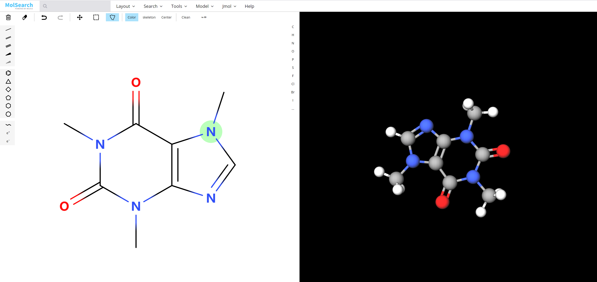
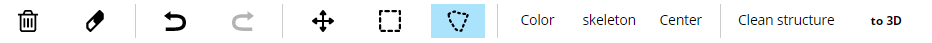

# MolSearch

# 前提环境

- ### [安装 Milvus CPU 版](https://milvus.io/cn/docs/v0.8.0/guides/get_started/install_milvus/cpu_milvus_docker.md)

- ### 安装 postgres


# 系统搭建

## 1. 启动 Milvus Docker

本次实验使用 Milvus-0.8.0-CPU 版，安装启动方法参考https://milvus.io/cn/docs/v0.8.0/guides/get_started/install_milvus/cpu_milvus_docker.md。

**注意：请使用以下命令启动 Milvus Docker**

```
# Start Milvus
$ docker run -d --name milvus_cpu \
-p 19530:19530 \
-p 19121:19121 \
-p 9091:9091 \
-v /home/$USER/milvus/db:/var/lib/milvus/db \
-v /home/$USER/milvus/conf:/var/lib/milvus/conf \
-v /home/$USER/milvus/logs:/var/lib/milvus/logs \
-v /home/$USER/milvus/wal:/var/lib/milvus/wal \
milvusdb/milvus:0.8.0-cpu-d041520-464400
```

## 2. 向 Milvus 中导入数据

向Milvus中导入.smi数据，其中第一列是smiles，第二列是id号，形如：

o1c(C(O)CNC(C)(C)C)cc2c1c(CC(=O)OC(C)(C)C)ccc2    10001

```bash
$ python insert_data.py -f <file_path>
```

## 3.启动 molsearch-webserver docker

```
$ docker run -td -p 35001:5000 -e "MILVUS_HOST=192.168.1.25" -e "MILVUS_PORT=19530" zilliz/molsearch-webserver:0.1.0
```

上述启动命令相关参数说明：

| 参数                          | 说明                                                         |
| ----------------------------- | ------------------------------------------------------------ |
| -p 35001:5000                 | -p 表示宿主机和 image 之间的端口映射                         |
| -e "MILVUS_HOST=192.168.1.25" | -e 表示宿主机和 image 之间的系统参数映射 请修改`192.168.1.25`为启动 Milvus docker 的服务器 IP 地址 |
| -e "MILVUS_PORT=19530"        | 请修改`19530`为启动 Milvus docker 的服务器端口号             |

## 4. 启动 molsearch-webclient docker

```
$ docker run -td -p 8001:80 -e API_URL=http://192.168.1.25:35001  zilliz/molsearch-webclient:0.1.0
```

> 参数 -e API_URL=[http://192.168.1.25:35001](http://192.168.1.25:35001/) 与本节第二部分相对应，请修改`192.168.1.25`为启动 Milvus docker 的服务器 IP 地址。


# 系统介绍

MolSearch 是基于 [Milvus](https://github.com/milvus-io/milvus)&[MolView](https://github.com/molview/legacy) 研发的一款开源化合物分析软件，主要有六个功能：结构编辑，化学式加载分子检索，工具类，3D模型展示，Jmol工具。



## 结构编辑

结构编辑包含了三部分的工具栏，可以在其中选择可使用的工具：

### 顶部工具栏

            

- 清除：清除整个画布的结构。
- 橡皮擦：擦除原子，化学键或当前选择的结构。
- 撤消/重做：撤消或重做最近的更改。
- 选择工具：
  - 拖动：可以使用鼠标左键移动整个化学结构。
  - 矩形选择：使用矩形选择指定的原子和化学键区域。
  - 套索选择：通过绘制不规则的区域来选择原子和化学键。
- color：带颜色地显示原子和化学键。
- skeleton：显示所有C和H原子，而不是只显示分子结构的骨架。
- Center：将整个化学结构居中。
- Clean structure：使用外部服务重整结构式。
- to 3D：将化学结构式转换为3D模型。

### 左侧工具栏

             

- 化学键：选择一种化学键类型，可以对化学结构进行添加或修改。
- 官能团：选择官能团（苯，环丙烷等）。
- 原子链：创建碳原子链。
- 电荷：增加或减少原子的电荷。

### 右侧工具栏


在此工具栏中，您可以从众多元素中进行选择，也可以使用最后一个按钮从元素周期表中选择指定元素。


## 化学式加载

 

可以输入smiles化学式或者药物名称，系统将加载对应的化学结构。


## 分子检索 - Search

这一功能将实现在数据底库中的化学结构检索：

- 相似性检索 - Similarity：搜索具有相似结构式的化合物。

- 子结构检索 - Substructure：搜索以当前结构为子集的化合物。

- 超结构检索 - Superstructure：搜索以当前结构为超集的化合物。


## 工具类 - Tools

工具菜单包含下面列出几个实用功能：

### 导出 - EXPORT

- Structural formula image：导出绘制的化合物结构。
- 3D model image：导出 3D 模型图片。
- MOL file：从 3D 模型导出 MDL Molfile。

### 信息卡 - INFORMATION CARD

可以显示分子结构式有关的基础信息。


## 3D 模型展示 - Model

Model 菜单包含了 3D 模型中一些常规的设置：

- Reset：此功能将 3D 模型设置回默认值。

### 模型展示 - REPERSENTATION

您可以将分子表示为各种形式，包括球/棒状，棒状，范德华球，线框和线。

### 背景 - BACKGROUND

您可以选择 3D 模型中的背景，默认背景为黑色。

### 引擎选择 - ENGINE

选择不同的渲染引擎：GLmol，Jmol 和 ChemDoodle。


## Jmol 工具

此菜单下提供了对三维结构的简单分析与计算功能。

- High Quality：在 Jmol 中启用高质量渲染。
- Clean：清除当前执行的计算和测量。

### 计算 - CALCULATIONS

- MEP surface Iucent/opaque：在半透明或不透明的 3D 模型表面上计算和投影分子静电势。
- Charge：计算和投影原子电荷。
- Bond dipoles：计算并绘制单键偶极子。
- Overall dipole：计算并绘制净键偶极子。
- Energy minimization：执行 MMFF94 能量最小化。

### 测量 - MEASUREMENT

- Distance：两个原子之间的距离
- Distance：两个原子之间的角度
- Torsion：多个原子之间的扭转度
